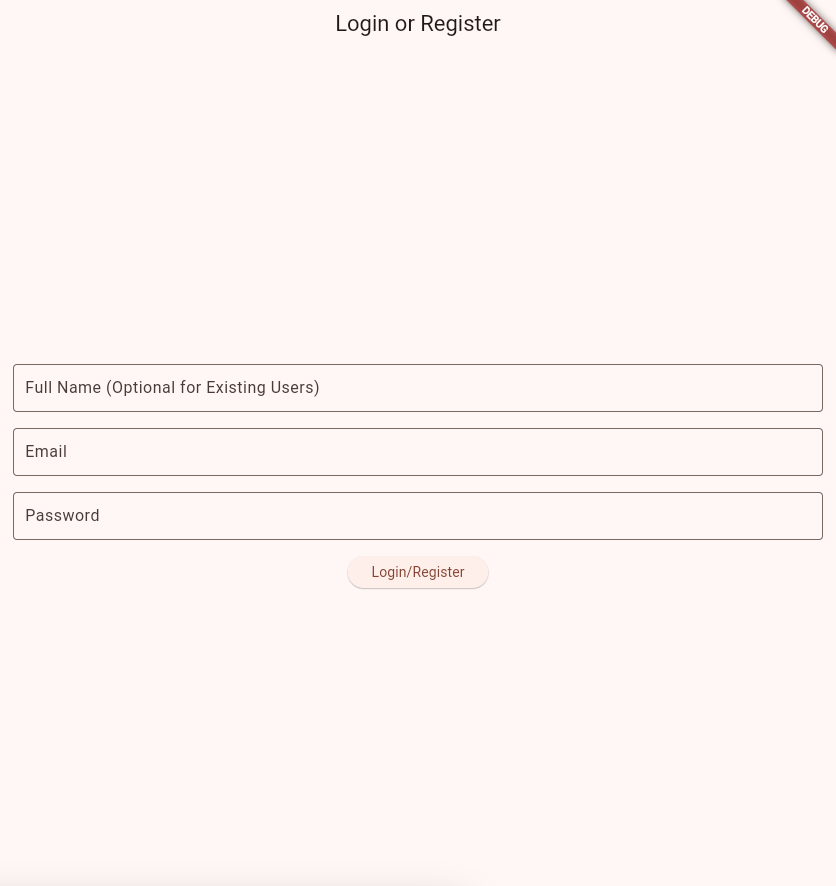

# Flutter Login App

A simple Flutter login app with basic user authentication functionality.

## Features

- **User authentication**: Implements a login screen that validates existing user credentials or registers a new user based on the input.
- **Responsive design**: Optimized for various screen sizes.
- **State management**: Uses `Provider` for state management.

## Screenshots




## Prerequisites

Before you begin, ensure you have met the following requirements:

- **Flutter**: [Install Flutter](https://flutter.dev/docs/get-started/install)
- **Dart**: Flutter uses Dart for programming. Dart comes pre-installed with Flutter.
- **Android Studio / VS Code**: Recommended for Flutter development.

## Getting Started

Follow these steps to set up the project locally:

### 1. Clone the repository

```bash
git clone https://github.com/LupeanAlexandru/flutter-login-app.git
cd flutter-login-app
```

### 2. Install dependencies

Run the following command to fetch the necessary packages:

```bash
flutter pub get
```

### 3. Run the app

Once the dependencies are installed, you can run the app on your machine:

```bash
flutter run
```